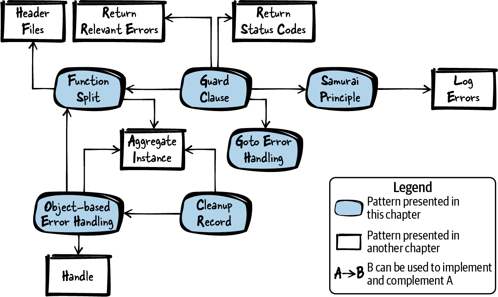

# ERROR HANDLING

## Figure 1-1: Overview of patterns for error handling


## Patterns for error handling
- __Function Split__: Split it up. Take a part of a function that seems useful on its own, create a new function with that, and call that function.
- __Guard Clause__: Check whether you have mandatory pre-conditions and immediately return from the function if these pre-conditions are not met.
- __Samurai Principle__: When returning error information, you assume that the caller checks for this information. 
However, the caller can simply omit this check and the error might go unnoticed. 
Therefore, return from a function victorious or not at all. 
If there is a situation for which you know that an error cannot be handled, then abort the program.
- __Goto Error Handing__: Have all resource cleanup and error handling at the end of the function. 
If a resource cannot be acquired, use the goto statement to jump to the resource cleanup code.
- __Cleanup Record__: Call resource acquisition functions as long as they succeed, and store which functions require cleanup. 
Call the cleanup functions depending on these stored values.
- __Object-based Error Handling__: Put initialization and cleanup into separate functions, 
similar to the concept of constructors and destructors in object-oriented programming.

## Tips:

1. **Abort the program in a structured way by using the `assert` statement.** 
Additionally, you can provide debug information with the `assert` statement as shown in the following code:
```c
void someFunction()
{
    assert(checkPreconditions() && "Preconditions are not met");
    mainFunctionality();
}
```
2. **Have all resource cleanup and error handling at the end of the function.** 
If a resource cannot be acquired, use the `goto` statement to jump to the resource cleanup code.
```c
void someFunction()
{
    if(!allocateResource1())
    {
        goto cleanup1;
    }
    if(!allocateResource2())
    {
        goto cleanup2;
    }
    mainFunctionality();
cleanup2:
    cleanupResource2();
cleanup1:
    cleanupResource1();
}
```
3. **Call resource acquisition functions as long as they succeed, and store which functions require cleanup. 
Call the cleanup functions depending on these stored values.**
In C, lazy evaluation of if statements can be used to achieve this. 
Simply call a sequence of functions inside a single if statement as long as these functions succeed.
For each function call, store the acquired resource in a variable. 
Have the code operating on the resources in the body of the if statement, and have all resource cleanup
after the if statement only if the resource was successfully acquired. 
The following code shows an example of this:
```c
void someFunction()
{
    if((r1=allocateResource1()) && (r2=allocateResource2()))
    {
        mainFunctionality();
    }
    if(r1)
    {
        cleanupResource1();
    }
    if(r2)
    {
        cleanupResource2();
    }
}
```
4. **Put initialization and cleanup into separate functions, similar to the concept of constructors and destructors in object-oriented programming.**
If resource allocation fails, store this information in a variable (for example, a NULL pointer if memory allocation fails). 
When using or cleaning up the resources, first check whether the resource is valid. 
Perform that check not in your main function, but rather in the called functions, because that makes your main function a lot more readable:
```c
void someFunction()
{
    allocateResources();
    mainFunctionality();
    cleanupResources();
}
```
