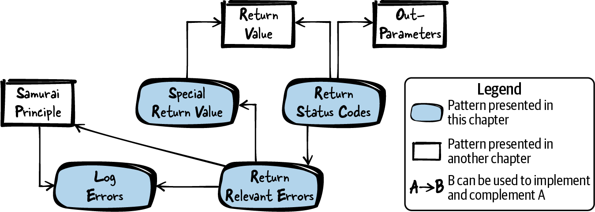

# Returning Error Information

## Figure 2-1. Overview of patterns for returning error information


## Patterns for returning error information
- **Return Status Code:** Use the Return Value of a function to return status information. 
Return a value that represents a specific status. 
Both of you as the callee and the caller must have a mutual understanding of what the value means.
- **Return Relevant Errors:** Only return error information to the caller if that information is relevant to the caller. 
Error information is only relevant to the caller if the caller can react to that information.
- **Special Return Value:** Use the Return Value of your function to return the data computed by the function. 
Reserve one or more special values to be returned if an error occurs.
- **Log Errors**: Use different channels to return error information that is relevant for
the calling code and error information that is relevant for the developer

## Tips:
1. **Define the numeric status identifiers in your API as an `enum` or by using `#define`.** 
Give the status identifiers a meaningful name and document their meaning with
comments. 
Make sure to name your status codes in a consistent way across your APIs.
```cpp
// Callee API providing status codes
typedef enum
{
    MINOR_ERROR,
    MAJOR_ERROR,
    OK
}ErrorCode;
ErrorCode func();

// Callee implementation providing status codes
ErrorCode func()
{
    if(minorErrorOccurs())
    {
        return MINOR_ERROR;
    }
    else if(majorErrorOccurs())
    {
        return MAJOR_ERROR;
    }
    else
    {
        return OK;
    }
}

// Caller’s code using status codes
ErrorCode status = func();
if(status == MAJOR_ERROR)
{
    /* abort program */
}
else if(status == MINOR_ERROR)
{
    /* handle error */
}
else if(status == OK)
{
    /* continue normal execution */
}


```
