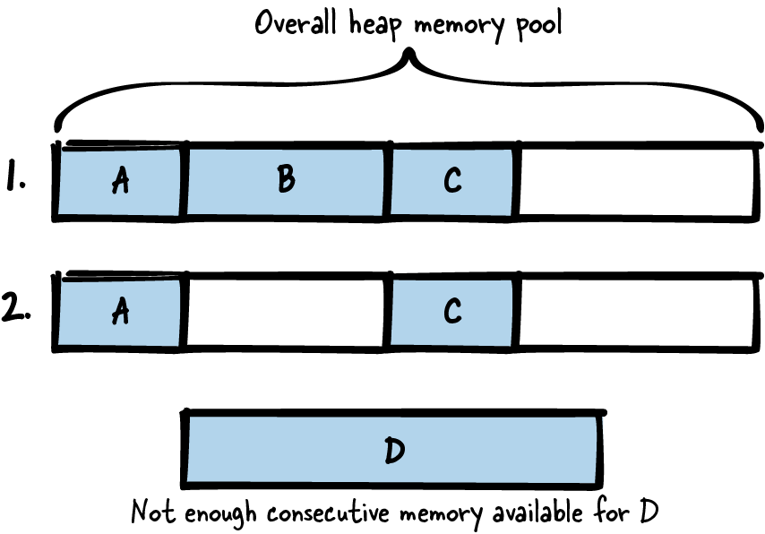

# Memory Management

## Figure 3-1. Overview of patterns for memory management


## Patterns for memory management
- **Stack First:** Deciding the storage class and memory section (stack, heap, …) for variables is a decision every programmer has to make often. 
It gets exhausting if for each and every variable, the pros and cons of all possible alternatives have to be considered in detail.
Therefore, simply **put your variables on the stack by default to profit from automatic cleanup of stack variables**.
- **Eternal Memory:** Holding large amounts of data and transporting it between function calls is difficult because you have to
make sure that the memory for the data is large enough and that the lifetime extends across your function calls. 
Therefore, **put your data into memory that is available throughout the whole lifetime of your program.**
- **Lazy Cleanup:** Having dynamic memory is required if you need large amounts of memory and memory where you don’t know the required size beforehand. 
However, handling cleanup of dynamic memory is a hassle and is the source of many programming errors. 
Therefore, **allocate dynamic memory and let the operating system cope with deallocation by the end of your program.**
- **Dedicated Ownership:** The great power of using dynamic memory comes with the great responsibility of having to properly clean that memory up. 
In larger programs, it becomes difficult to make sure that all dynamic memory is cleaned up properly. 
Therefore, right at the time **when you implement memory allocation, clearly define and
document where it’s going to be cleaned up and who is going to do that.**
- **Allocation Wrapper:** Each allocation of dynamic memory might fail, so you should check allocations in your code to react accordingly. 
This is cumbersome because you have many places for such checks in your code. 
Therefore, **wrap the allocation and deallocation calls, and implement error handling or 
additional memory management organization in these wrapper functions.**
- **Pointer Check:** Programming errors that lead to accessing an invalid pointer cause uncontrolled program behavior, and
such errors are difficult to debug. However, because your code works with pointers frequently, there is a
good chance that you have introduced such programming errors. Therefore, **explicitly invalidate
uninitialized or freed pointers and always check pointers for validity before accessing them.**
- **Memory Pool:** Frequently allocating and deallocating objects from the heap leads to memory fragmentation. 
Therefore, **hold a large piece of memory throughout the whole lifetime of your program. 
At runtime, retrieve fixed-size chunks of that memory pool instead of directly allocating new memory from the heap.**

## Data Storage and Problems with Dynamic Memory

### Data Storage:
- **Stack:** The stack is a **fixed-size memory** reserved for each thread (**allocated when creating the thread**). 
When calling a function in such a thread, a block on the top of the stack is reserved for the function parameters
and automatic variables used by that function. 
**After the function call, that memory is automatically cleaned up.** 
To put data on the stack, simply declare variables in the functions where they are used. 
These variables can be accessed as long as they don’t run out of scope (when the function block ends)
```c
void main()
{
    int my_data;
}
```

- **Static memory:** The static memory is a **fixed-size memory** in which the allocation logic is fixed at compile time. 
To use the static memory, simply place the `static` keyword in front of your variable declaration. 
Such variables are **available throughout the whole lifetime of your program.** 
The same holds true for global variables, even without the `static` keyword:
```c
int my_global_data;
static int my_fileglobal_data;
void main()
{
    static int my_local_data;
}
```

- If your data is of **fixed size and immutable**, you can simply store it directly in the static memory where the code is stored. 
Quite often, fixed string values are stored this way. Such data is **available throughout the whole lifetime of your program** 
(even though, in the example below, the pointer to that data runs out of scope):
```c
void main()
{
    char* my_string = "Hello World";
}
```

- **Heap:** You can allocate dynamic memory on the heap to store the data. 
The heap is a global memory pool **available for all processes on the system**, and it is up to the
programmer to allocate and deallocate from that pool at any time:
```c
void main()
{
    void* my_data = malloc(1000);
    /* work with the allocated 1000 byte memory */
    free(my_data);
}
```

### Dynamic Memory Problems:
- **Memory leak:** If that happens frequently and your applications runs for a long time, you’ll end up having no additional memory.
- **Freeing memory more than once** is a problem and can lead to undefined program behavior.
- **Dangling pointer**: Trying to access freed memory is a problem as well. 
It is easy to free some memory and then later on make a mistake and dereference a pointer to that memory.
- You have to **cope with lifetime and ownership of allocated data.** You have to know who cleans up which data when. 
Because C don’t have destructors. We are not notified when a pointer runs out of scope and the memory should be cleaned up.
- Working with heap memory **takes more time** compared to working with memory from the stack or with static memory:
  - protected against race conditions
  - stack memory is accessed more often (more likely already resides in the cache or in CPU registers)
- **Heap memory becomes fragmented**, which is depicted in *Figure 3-2*. 
Fragmentation is a huge issue in memory-constrained systems that run for a long time (like embedded real-time systems).

    

## Tips:
1. **Simply put your variables on the stack by default to profit from automatic cleanup of stack variables.** 
All variables declared inside a code block are by default so-called *automatic variables* 
that are put on the stack and automatically cleaned up once the code block ends. 
**Make sure not to return the address of such a variable**, cause it would lead to a dangling pointer.
```c
void someCode()
{
    /* This variable is an automatic variable that is put on the stack and
    that will run out of scope at the end of the function */
    int my_variable;
    {
        /* This variable is an automatic variable that is put on the stack and
        that will run out of scope right after this code block, which is
        after the first '}' */
        int my_array[10];
    }
}
```

2. **Put your data into memory that is available throughout the whole lifetime of your program.** 
Either mark your variable with the `static` storage-class specifier, or if you want the variable to have larger scope, 
declare it outside any function (but only do that if you really need the larger scope).
```c
#define ARRAY_SIZE 1024
int global_array[ARRAY_SIZE]; /* variable in static memory, global scope */
static int file_global_array[ARRAY_SIZE]; /* variable in static memory with scope limited to this file */

void someCode()
{
    static int local_array[ARRAY_SIZE]; /* variable in static memory with scope limited to this function */
}
```

3. **Allocate dynamic memory and let the operating system cope with deallocation by the end of your program.** 
When your program ends and the operating system cleans up your process, most modern operating systems 
also clean up any memory that you allocated and didn’t deallocate.
```c
void someCode()
{
    char* memory = malloc(size);
    /* do something with the memory */
    /* don't care about freeing the memory */
}
```
This approach looks very brutal at first sight. You deliberately create memory leaks. 
However, that’s the style of coding you’d also use in other **programming languages that have a garbage collector**. 
Deliberately having memory leaks might be an option for some applications, 
particularly those that **don’t run for a very long time and that don’t allocate very often.** 

4. **Right at the time when you implement memory allocation, clearly define and document where it’s going to be cleaned up and who is going to do that.** 
Best case, even before writing your first `malloc`, you should have asked yourself where that memory will be freed. 
In other programming languages, like C++, you have the option to use code constructs for documenting this. 
Pointer constructs like `unique_ptr` or `shared_ptr` make it possible to see from the function declarations 
who is responsible for cleaning the memory up. 
If possible, make the same function responsible for allocation and deallocation, just as it is with **Object-Based Error Handling.**
```c
#define DATA_SIZE 1024
void function()
{
char* memory = malloc(DATA_SIZE);
/* work with memory */
free(memory);
}
```
If the responsibility for allocation and deallocation is spread across the code and if ownership of memory is transferred, it gets complicated. 
In some cases, this will be necessary, for example, if only the allocating function knows the size of the data and
that data is needed in other functions:
```c
/* Allocates and returns a buffer that has to be freed by the caller */
char* functionA()
    {
    char* memory = malloc(data_size);
    /* fill memory */
    return memory;
}

void functionB()
{
    char* memory = functionA();
    /* work with the memory */
    free(memory);
}
```

5. **Wrap the allocation and deallocation calls, and implement error handling or additional memory management organization in these wrapper functions.** 
Implement a wrapper function for the `malloc` and `free` calls, and for memory allocation and deallocation only call these wrapper functions. 
In the wrapper function, you can implement error handling at one central point:
```c
void* checkedMalloc(size_t size)
{
    void* pointer = malloc(size);
    assert(pointer);
    return pointer;
}

#define DATA_SIZE 1024
void someFunction()
{
    char* memory = checkedMalloc(DATA_SIZE);
    /* work with the memory */
    free(memory);
}
```
With macros for allocation and deallocation you could even build a constructor-like syntax:
```c
#define NEW(object, type)                   \
do {                                        \
    object = malloc(sizeof(type));          \
    if(!object)                             \
    {                                       \
    printf("Malloc Error: %s\n", __func__); \
    assert(false);                          \
    }                                       \
} while (0)

#define DELETE(object) free(object)

typedef struct{
    int x;
    int y;
}MyStruct;

void someFunction()
{
    MyStruct* myObject;
    NEW(myObject, MyStruct);
    /* work with the object */
    DELETE(myObject);
}
```

6. **Explicitly invalidate uninitialized or freed pointers and always check pointers for validity before accessing them.** 
Right at the variable declaration, set pointer variables explicitly to `NULL`. Also, right after calling free, set them explicitly to `NULL`.
```c
void someFunction()
{
    char* pointer = NULL; /* explicitly invalidate the uninitialized pointer */
    pointer = malloc(1024);

    if (pointer != NULL) /* check pointer validity before accessing it */
    {
    /* work with pointer*/
    }

    free(pointer);
    pointer = NULL; /* explicitly invalidate the pointer to freed memory */
}
```

7. **Hold a large piece of memory throughout the whole lifetime of your program. 
At runtime, retrieve fixed-size chunks of that memory pool instead of directly allocating new memory from the heap.** 
The memory pool can either be placed in static memory or it can be allocated from the heap at program startup and freed at the end of the program. 
Allocation from the heap has the advantage that, if needed, additional memory can be allocated to increase the size of the memory pool.
```c
#define MAX_ELEMENTS 20;
#define ELEMENT_SIZE 255;
typedef struct
{
    bool occupied;
    char memory[ELEMENT_SIZE];
}PoolElement;

static PoolElement memory_pool[MAX_ELEMENTS];

/* Returns memory of at least the provided 'size' or NULL
if no memory chunk from the pool is available */
void* poolTake(size_t size)
{
    if(size <= ELEMENT_SIZE)
    {
        for(int i=0; i<MAX_ELEMENTS; i++)
        {
            if(memory_pool[i].occupied == false)
            {
                memory_pool[i].occupied = true;
                return &(memory_pool[i].memory);
            }
        }
    }
    return NULL;
}

/* Gives the memory chunk ('pointer') back to the pool */
void poolRelease(void* pointer)
{
    for(int i=0; i<MAX_ELEMENTS; i++)
    {
        if(&(memory_pool[i].memory) == pointer)
        {
            memory_pool[i].occupied = false;
            return;
        }
    }
}
```


## Useful things you may not have known before:
1. **Variable Length Arrays:**

The array in the preceding code is of fixed size. It is very common to put only data of fixed size known at compile time on the stack,
but it is also possible to **decide the size of stack variables during runtime**. This is done using functions like `alloca()` 
(which is not part of the C standard and which causes stack overflows if you allocate too much) 
or using variable length arrays (regular arrays whose size is specified by a variable), which are introduced with the C99 standard.

2. **Linux Overcommit:**

Modern Linux systems work with the overcommit principle. This principle provides virtual memory to the program that allocates, 
but this **virtual memory has no direct correspondence to physical memory**. 
Whether the required physical memory is available is checked once you access that memory. 
If not enough physical memory is available, the Linux kernel shuts down applications that consume a lot of memory (and that might be your application). 
But overcommit comes with the big disadvantage that even with a valid pointer, 
**you can never be sure that your memory access works and will not lead to a crash**. 

