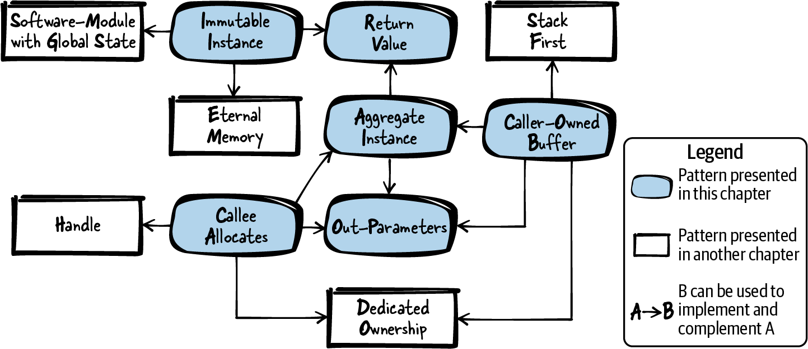
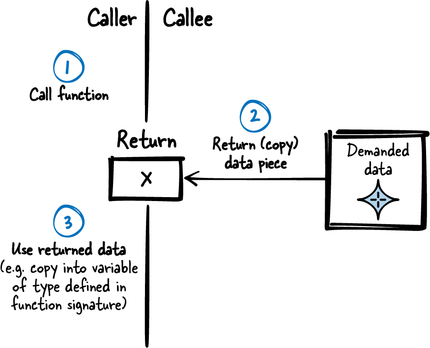
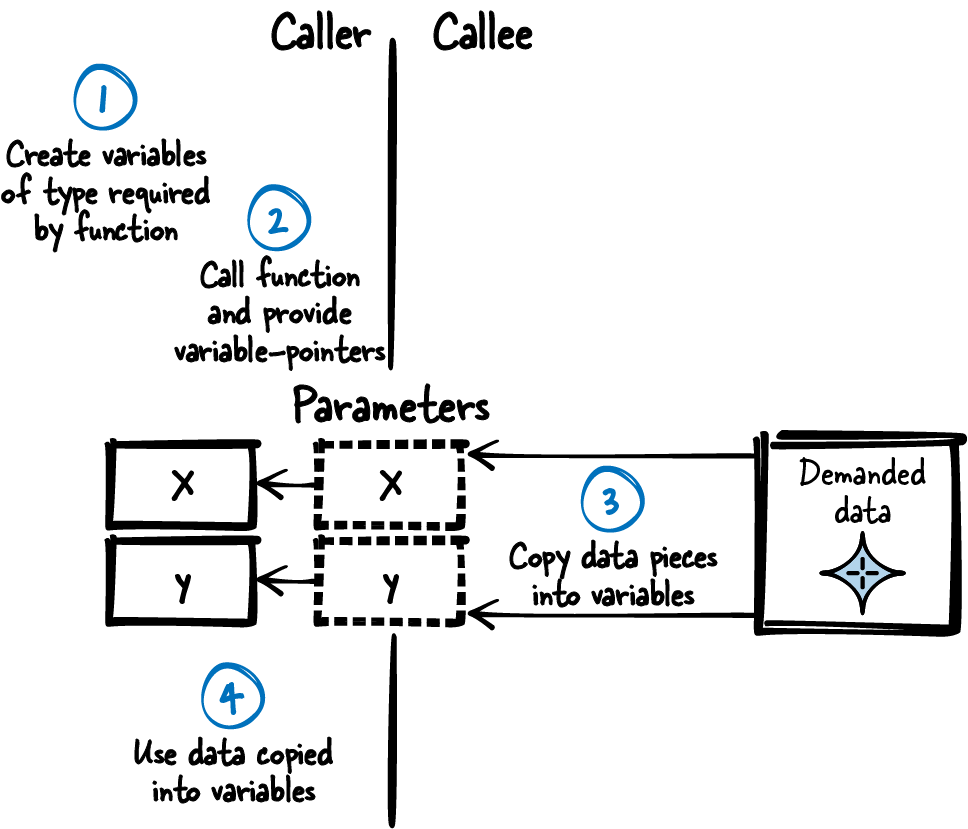
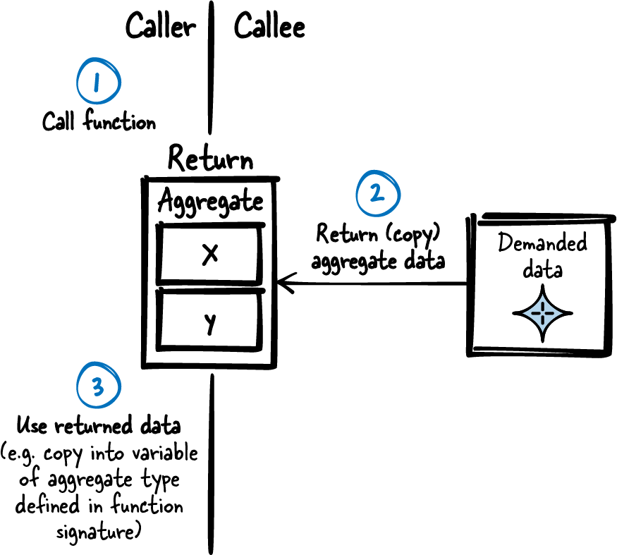
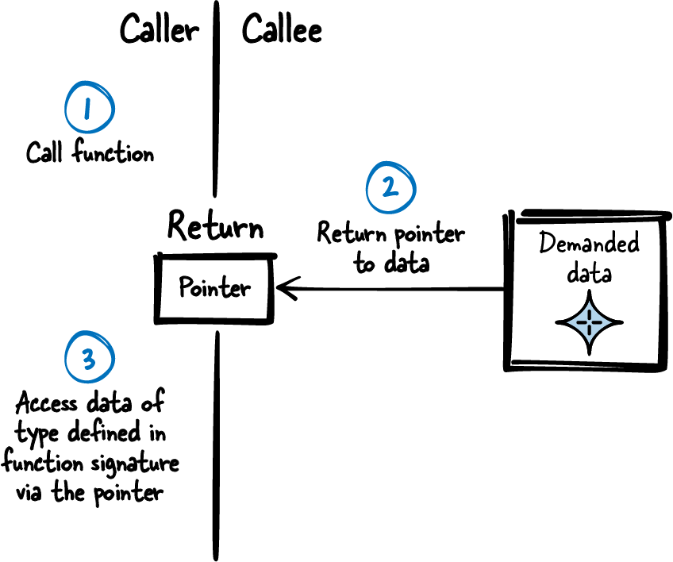
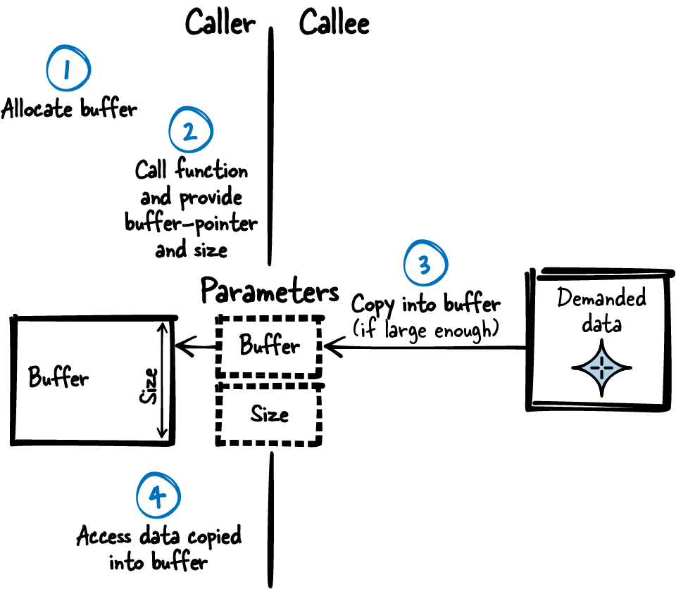
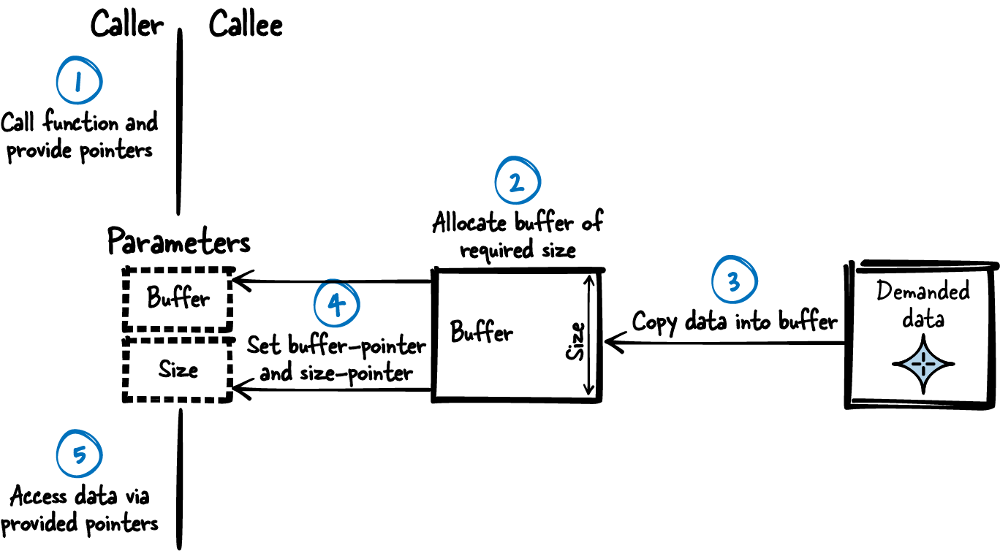

# Returning Data from C Functions

## Figure 4-1. Overview of patterns for returning information


## Patterns for returning information
- **Return Value:** Simply use the one C mechanism intended to retrieve information about the result of a function call: the Return Value. 
**The mechanism to return data in C copies the function result and provides the caller access to this copy.**
- **Out-Parameters:** **Return all the data with a single function call by emulating by-reference arguments with pointers.**
- **Aggregate Instance:** C only supports returning a single type from a function call, which makes it complicated to return multiple pieces of information. 
Therefore, **put all data that is related into a newly defined type.** 
Define this Aggregate Instance to contain all the related data that you want to share. 
Define it in the interface of your component to let the caller directly access all the data stored in the instance.
- **Immutable Instance:** You want to provide information held in large pieces of immutable data from your component to a caller. 
Therefore, **have an instance (for example, a `struct`) containing the data to share in static memory.** 
Provide this data to users who want to access it and make sure that they cannot modify it.
- **Caller-Owned Buffer:** You want to provide complex or large data of known size to the caller, and that data is not immutable (it changes at runtime). 
Therefore, **require the caller to provide a buffer and its size** to the function that returns the large, complex data. 
In the function implementation, **copy the required data into the buffer if the buffer size is large enough.**
- **Callee Allocates:** You want to provide complex or large data of unknown size to the caller, and that data is not immutable (it changes at runtime). 
Therefore, **allocate a buffer with the required size inside the function** that provides the large, complex data. 
**Copy the required data into the buffer and return a pointer to that buffer.**

## Tips:
1. Figure 4-2 and the following code show how to implement the Return Value:
    ### Figure 4-2. Return Value
    

```c
// Caller’s code
int my_data = getData();
/* use my_data */

// Callee’s code
int getData()
{
    int requested_data;
    /* .... */
    return requested_data;
}
```

2. C does not support returning multiple types using the Return Value, nor does C natively support by-reference arguments, 
but by-reference arguments can be emulated as shown in Figure 4-3 and the following code.
    ### Figure 4-3. Out-Parameters
    

```c
// Caller’s code
int x,y;
getData(&x,&y);
/* use x,y */

// Callee’s code
void getData(int* x, int* y)
{
    *x = 42;
    *y = 78;
}
```

3. Define a struct in your header file and define all types to be returned from the called function as members of this struct. 
In the function implementation, copy the data to be returned into the struct members as shown in Figure 4-4.
    ### Figure 4-4. Aggregate Instance
    

    The following code shows the variant with passing the whole struct:
```c
// Caller’s code
struct AggregateInstance my_instance;
my_instance = getData();
/*  use my_instance.x
    use my_instance.y, ... */

//Callee’s code
struct AggregateInstance
{
    int x;
    int y;
};

struct AggregateInstance getData()
{
    struct AggregateInstance inst;
    /* fill inst.x and inst.y */
    return inst;
}
```

4. Have an instance (for example, a `struct`) containing the data to share in static memory. 
Provide this data to users who want to access it and make sure that they cannot modify it.
As shown in Figure 4-5, even if multiple callers (and multiple threads) access the instance at the same time, 
they don’t have to worry about each other because the instance does not change and is thus always in a consistent state
and contains the required information.
    ### Figure 4-5. Immutable Instance
    

    To make sure that the caller does not modify the data, when returning a pointer to the data, 
make the data being pointed to const as shown in the following code:
```c
// Caller’s code
const struct ImmutableInstance* my_instance;
my_instance = getData();
/*  use my_instance->x,
    use my_instance->y, ... */

// Callee API
struct ImmutableInstance
{
    int x;
    int y;
};

// Callee Implementation
static struct ImmutableInstance inst = {12, 42};
const struct ImmutableInstance* getData()
{
    return &inst;
}
```

5. Figure 4-6 and the following code show the concept of a Caller-Owned Buffer:
    ### Figure 4-6. Caller-Owned Buffer
    

```c
// Caller’s code
struct Buffer buffer;
getData(&buffer);
/* use buffer.data */

// Callee’s API
#define BUFFER_SIZE 256
struct Buffer
{
    char data[BUFFER_SIZE];
};
void getData(struct Buffer* buffer);

// Callee’s implementation
void getData(struct Buffer* buffer)
{
    memcpy(buffer->data, some_data, BUFFER_SIZE);
}
```

6. Provide the pointer to the buffer and its size to the caller as Out-Parameters. 
After the function call, the caller can operate on the buffer, knows its size, and has the sole ownership of the buffer. 
The caller determines its lifetime and thus is responsible for cleaning it up as shown in Figure 4-7 and the following code.
    ### Figure 4-7. Callee Allocates
    

```c
// Caller’s code
char* buffer;
int size;
getData(&buffer, &size);
/* use buffer */
free(buffer);

// Callee’s code
void getData(char** buffer, int* size)
{
    *size = data_size;
    *buffer = malloc(data_size);
    /* write data to buffer */
}
```