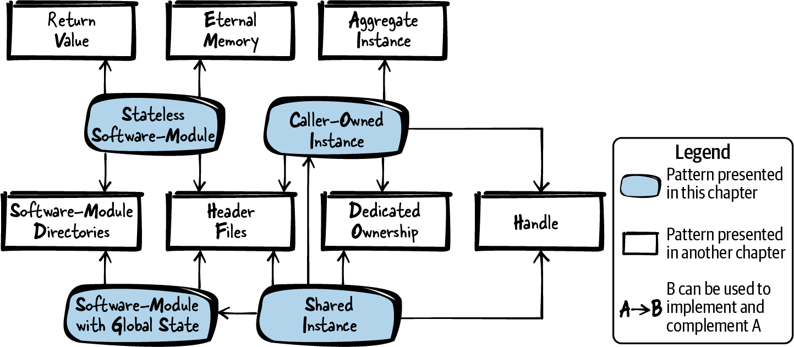
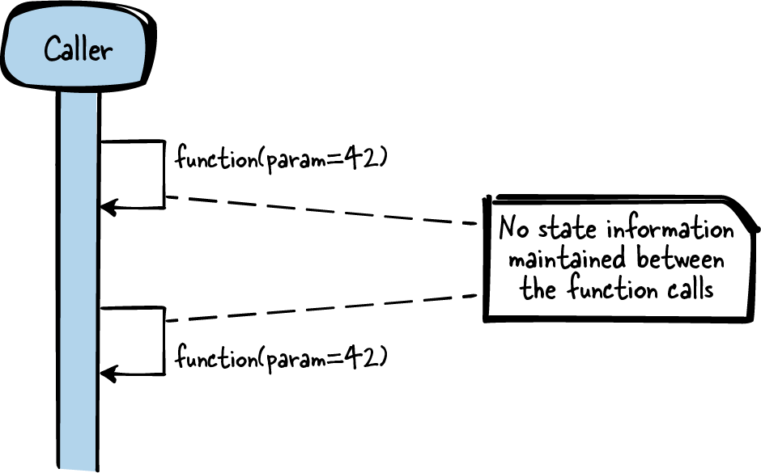
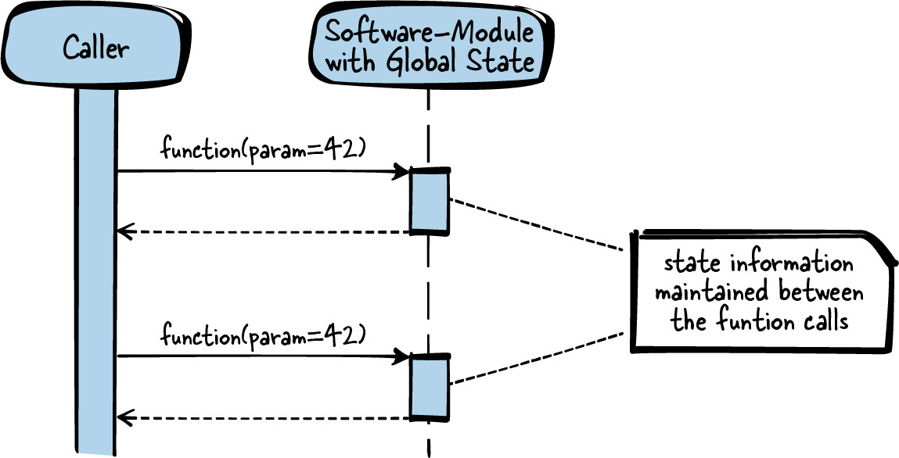
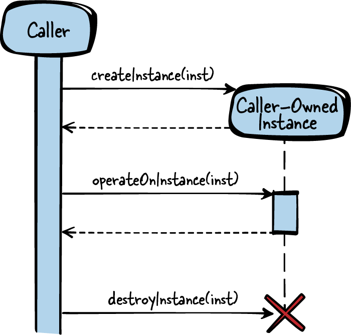
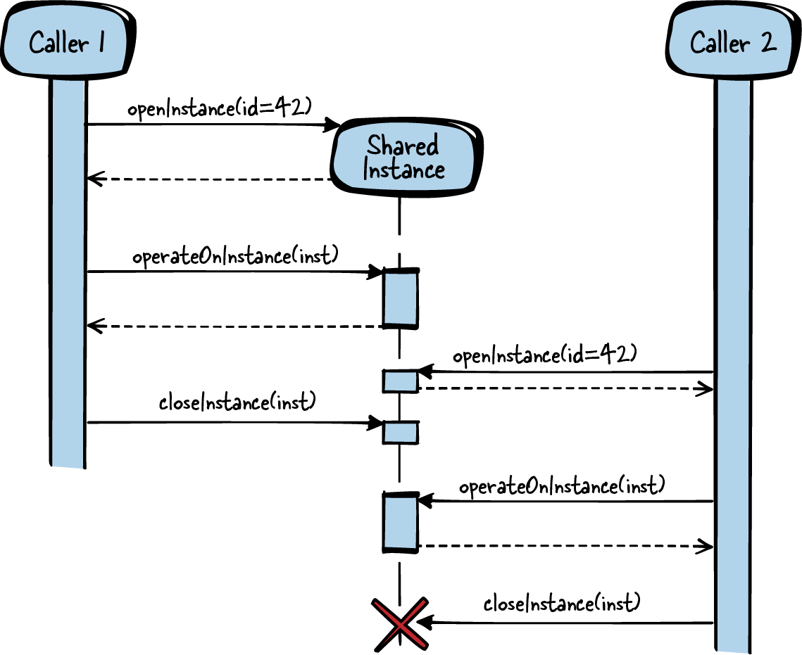

# Data Lifetime and Ownership

## Figure 5-1. Overview of patterns for lifetime and ownership


## Patterns for lifetime and ownership:
- **Stateless Software-Module:** You want to provide logically related functionality to your caller and make that functionality as easy as
possible for the caller to use. Therefore, keep your functions simple and don’t build up state information in
your implementation. Put all related functions into one header file and provide the caller this interface to
your software-module.
- **Software-Module with Global State:** You want to structure your logically related code that requires common state information and make that
functionality as easy as possible for the caller to use. Therefore, have one global instance to let your related
functions share common resources. Put all functions that operate on the instance into one header file and
provide the caller this interface to your software-module.
- **Caller-Owned Instance:** You want to provide multiple callers or threads access to functionality with functions that depend on one
another, and the interaction of the caller with your functions builds up state information. Therefore, require
the caller to pass an instance, which is used to store resource and state information, along to your
functions. Provide explicit functions to create and destroy these instances, so that the caller can determine
their lifetime.
- **Shared Instance:** You want to provide multiple callers or threads access to functionality with functions that depend on one
another, and the interaction of the caller with your functions builds up state information, which your
callers want to share. Therefore, require the caller to pass an instance, which is used to store resource and
state information, along to your functions. Use the same instance for multiple callers and keep the
ownership of that instance in your software-module.

## Tips:
1. **Stateless Software-Module:** 
Put the declarations of the related functions into one Header File, and put the imple‐
mentations of the functions into one or more implementation files, but into the same
Software-Module Directory.
    ### Figure 5-2. Stateless Software-Module
    

```c
// Caller’s code
int result = sum(10, 20);

// API (header file)
/* Returns the sum of the two parameters */
int sum(int summand1, int summand2);

// Implementation
int sum(int summand1, int summand2)
{
    /* calculate result only depending on parameters and
    not requiring any state information */
    return summand1 + summand2;
}
```

2. **Software-Module with Global State:** 
Put the function declaration in one Header File, and put all the implementations for
your software-module into one implementation file in a Software-Module Directory.
In this implementation file, have a global instance (a file-global `static struct` or several
file-global `static` variables — see Eternal Memory) that holds the common shared
resources that should be available for your function implementations. Your function
implementations can then access these shared resources similar to how private variables 
work in object-oriented programming languages.
    ### Figure 5-3. Software-Module with Global State
    

```c
// Caller’s code
int result;
result = addNext(10);
result = addNext(20);

// API (header file)
/* Adds the parameter 'value' to the values accumulated
with previous calls of this function. */
int addNext(int value);

// Implementation
static int sum = 0;
int addNext(int value)
{
    /* calculation of the result depending on the parameter
    and on state information from previous function calls */
    sum = sum + value;
    return sum;
}
```

3. **Caller-Owned Instance:**
To implement such an instance that can be accessed from multiple functions, pass a
struct pointer along with all functions that require sharing resources or state information. 
The functions can now use the struct members, which are similar to private variables 
in object-oriented languages, to store and read resource and state information.

The struct can be declared in the API to let the caller conveniently access its mem‐
bers directly. Alternatively, the struct can be declared in the implementation, and
only a pointer to the struct can be declared in the API (as suggested by Handle). The
caller does not know the struct members (they are like private variables) and can
only operate with functions on the struct.

    ### Figure 5-4. Caller-Owned Instance
    

```c
// Caller’s code
struct INSTANCE* inst;
inst = createInstance();
operateOnInstance(inst);
/* access inst->x or inst->y */
destroyInstance(inst);

// API (header file)
struct INSTANCE
{
    int x;
    int y;
};

/* Creates an instance which is required for working
with the function 'operateOnInstance' */
struct INSTANCE* createInstance();

/* Operates on the data stored in the instance */
void operateOnInstance(struct INSTANCE* inst);

/* Cleans up an instance created with 'createInstance' */
void destroyInstance(struct INSTANCE* inst);

// Implementation
struct INSTANCE* createInstance()
{
    struct INSTANCE* inst;
    inst = malloc(sizeof(struct INSTANCE));
    return inst;
}

void operateOnInstance(struct INSTANCE* inst)
{
    /* work with inst->x and inst->y */
}

void destroyInstance(struct INSTANCE* inst)
{
    free(inst);
}
```

4. **Shared Instance:**
Provide a struct pointer or a Handle that the
caller then passes along the function calls. When creating the instance, the caller now
also has to provide an identifier (for example, a unique name) to specify the kind of
instance to create. With this identifier you can know if such an instance already exists.
If it exists, you don’t create a new instance, but instead return the struct pointer or
Handle to the instance that you already created and returned to other callers.

    ### Figure 5-5. Shared Instance
    

```c
// Caller1’s code
struct INSTANCE* inst = openInstance(INSTANCE_TYPE_B);
/* operate on the same instance as caller2 */
operateOnInstance(inst);
closeInstance(inst);

// Caller2’s code
struct INSTANCE* inst = openInstance(INSTANCE_TYPE_B);
/* operate on the same instance as caller1 */
operateOnInstance(inst);
closeInstance(inst);

// API (header file)
struct INSTANCE
{
    int x;
    int y;
};

/* to be used as IDs for the function openInstance */
#define INSTANCE_TYPE_A 1
#define INSTANCE_TYPE_B 2
#define INSTANCE_TYPE_C 3

/* Retrieve an instance identified by the parameter 'id'. That instance is
created if no instance of that 'id' was yet retrieved from any
other caller. */
struct INSTANCE* openInstance(int id);

/* Operates on the data stored in the instance. */
void operateOnInstance(struct INSTANCE* inst);

/* Releases an instance which was retrieved with 'openInstance'.
If all callers release an instance, it gets destroyed. */
void closeInstance(struct INSTANCE* inst);

// Implementation
#define MAX_INSTANCES 4

struct INSTANCELIST
{
struct INSTANCE* inst;
int count;
};

static struct INSTANCELIST list[MAX_INSTANCES];

struct INSTANCE* openInstance(int id)
{
    if(list[id].count == 0)
    {
        list[id].inst = malloc(sizeof(struct INSTANCE));
    }
    list[id].count++;
    return list[id].inst;
}

void operateOnInstance(struct INSTANCE* inst)
{
    /* work with inst->x and inst->y */
}

static int getInstanceId(struct INSTANCE* inst)
{
    int i;
    for(i=0; i<MAX_INSTANCES; i++)
    {
        if(inst == list[i].inst)
        {
            break;
        }
    }
    return i;
}

void closeInstance(struct INSTANCE* inst)
{
    int id = getInstanceId(inst);
    list[id].count--;
    if(list[id].count == 0)
    {
        free(inst);
    }
}
```