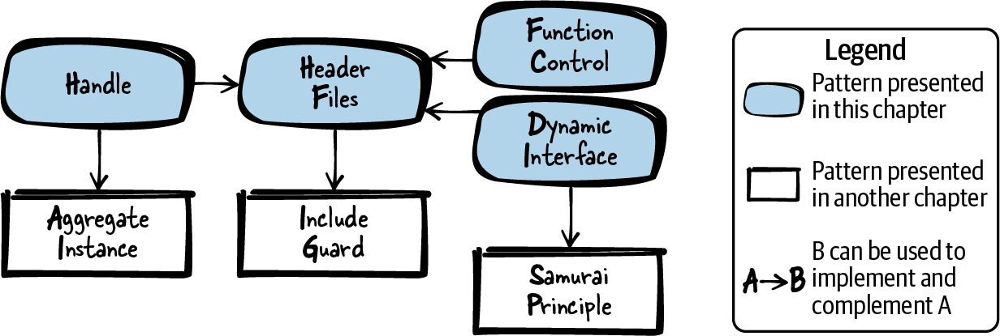

# Flexible APIs

## Figure 6-1. Overview of patterns for flexible APIs


## Patterns for flexible APIs
- **Header Files:** 
You want a functionality that you implement to be accessible to code from other implementation files, but
you want to hide your implementation details from the caller. Therefore, provide function declarations in your
API for any functionality you want to provide to your user. Hide any internal functions, internal data, and your
function definitions (the implementations) in your implementation file and don’t provide this implementation
file to the user.
- **Handle:** 
You have to share state information or operate on shared resources in your function implementations, but you
don’t want your caller to see or even access all that state information and shared resources. Therefore, have a
function to create the context on which the caller operates and return an abstract pointer to internal data for
that context. Require the caller to pass that pointer to all your functions, which can then use the internal data
to store state information and resources.
- **Dynamic Interface:** 
It should be possible to call implementations with slightly deviating behaviors, but it should not be necessary
to duplicate any code, not even the control logic implementation and interface declaration. Therefore, define
a common interface for the deviating functionalities in your API and require the caller to provide a callback
function for that functionality, which you then call in your function implementation.
- **Function Control:** 
You want to call implementations with slightly deviating behaviors, but you don’t want to duplicate any
code, not even the control logic implementation or the interface declaration. Therefore, add a parameter to
your function that passes meta-information about the function call and that specifies the actual functionality
to be performed.

## Tips:
1. **Header Files:**
    
    In C, it is a common convention that anybody who uses functions of your software
only uses functions defined in your header file (*.h file) and does not use other func‐
tions in your implementation (your *.c files). In some cases, this abstraction can be
partially enforced (for example, you cannot use a `static` function from another file),
but the C language does not support such enforcements to the full extent. Therefore,
the convention of not accessing other implementation files is even more important
than the enforcement mechanisms.

    **Within the header file, make sure to include all related artifacts needed by your func‐
tions in the header file.** It should not be neccessary for your caller to include other
header files in order to be able to use the functionality from your header file. **If you
have common declarations (like data types or `#defines`) that are needed in multiple
header files, then put these declarations into a separate header file and include it in
the other header files that need the declarations.** To ensure that the header files are
not included multiple times in a compilation unit, protect them with Include Guards.

    **Only put functions into the same header file if they are related.** If the functions oper‐
ate on the same Handle or perform an operation in the same domain (like math cal‐
culations), then that is an indicator to put them into the same header file. In general,
if you can think of a relevant use case that requires all of the functions, then you
should put them into the same header file.

    **Clearly document the behavior of your API in the header file.** The user should not be
required to have a look at the implementation in order to understand how the func‐
tions provided in the API work.

```c
// API (h-file)

/* Sorts the numbers of the 'array' in ascending order.
'length' defines the number of elements in the 'array'. */
void sort(int* array, int length);

// Implementation (c-file)

void sort(int* array, int length)
{
    /* here goes the implementation*/
}
```

2. **Handle:**

    Your functions know how to interpret this abstract pointer, which is an opaque data
type also called Handle. However, **the data structure that you point to should not be
part of the API. The API only provides the functionality to relay hidden data to the
functions.**

    The Handle can be implemented as a pointer to an Aggregate Instance like a `struct`.
The `struct` should contain all required state information or other variables—it usu‐
ally holds variables similar to those you would declare as member variables for
objects in object-oriented programming. The struct should be hidden in your
implementation.

    The API only contains the definition of a pointer to the struct as
shown in the following code:

```c
// API

typedef struct SORT_STRUCT* SORT_HANDLE;
SORT_HANDLE prepareSort(int* array, int length);
void sort(SORT_HANDLE context);

// Implementation

struct SORT_STRUCT
{
    int* array;
    int length;
    /* other parameters like sort order */
};

SORT_HANDLE prepareSort(int* array, int length)
{
    struct SORT_STRUCT* context = malloc(sizeof(struct SORT_STRUCT));
    context->array = array;
    context->length = length;
    /* fill context with required data or state information */
    return context;
}

void sort(SORT_HANDLE context)
{
    /* operate on context data */
}
```

3. **Dynamic Interface:** To implement such an interface in C, define function signatures in your API. The
caller then implements functions according to these signatures and attaches them via
function pointers. They can either be attached and stored permanently inside your
software-module or they can be attached with each function call as shown in the fol‐
lowing code:

```c
// API
/* The compare function should return true if x is smaller than y, else false */
typedef bool (*COMPARE_FP)(int x, int y);
void sort(COMPARE_FP compare, int* array, int length);

// Implementation

void sort(COMPARE_FP compare, int* array, int length)
{
    int i, j;
    for(i=0; i<length; i++)
    {
        for(j=i; j<length; j++)
        {
            /* call provided user function */
            if(compare(array[i], array[j]))
            {
                swap(&array[i], &array[j]);
            }
        }
    }
}

// Caller

#define ARRAY_SIZE 4

bool compareFunction(int x, int y)
{
    return x<y;
}

void sortData()
{
    int array[ARRAY_SIZE] = {3, 5, 6, 1};
    sort(compareFunction, array, ARRAY_SIZE);
}
```

4. **Function Control:** 
Compared to a Dynamic Interface, you do not require the caller to provide the implementation, 
but instead the caller selects from existing implementations.
To implement this pattern, you apply data-based abstraction by adding an additional
parameter (for example, an `enum` or `#define` integer value) that specifies the func‐
tion’s behavior. The parameter is then evaluated in the implementation, and depend‐
ing on the value of the parameter, different implementations are called:

```c
// API
#define QUICK_SORT 1
#define MERGE_SORT 2
#define RADIX_SORT 3

void sort(int algo, int* array, int length);

// Implementation
void sort(int algo, int* array, int length)
{
    switch(algo)
    {
        case QUICK_SORT:
            quicksort(array, length);
        break;
        case MERGE_SORT:
            mergesort(array, length);
        break;
        case RADIX_SORT:
            radixsort(array, length);
        break;
    }
}
```

## Useful things you may not have known before:
1. **SOLID:**

    The SOLID principles tell us how to implement good, flexible, and maintainable software.

    **Single-responsibility principle** - The code has one responsibility and one reason to be changed in the future.

    **Open-closed principle** - Code should be open for behavior changes without requiring changes to the existing code.

    **Liskow substitution principle** - Codes that implement the same interface should be interchangable for the caller.

    **Interface segregation principle** - Interfaces should be slim and tailored for the caller’s needs.

    **Dependency inversion principle** - High-level modules should be independent from low-level modules.